# Flowcharts & Diagrams
# Sistem Manajemen Perpustakaan Digital

---

## 1. Authentication Flow

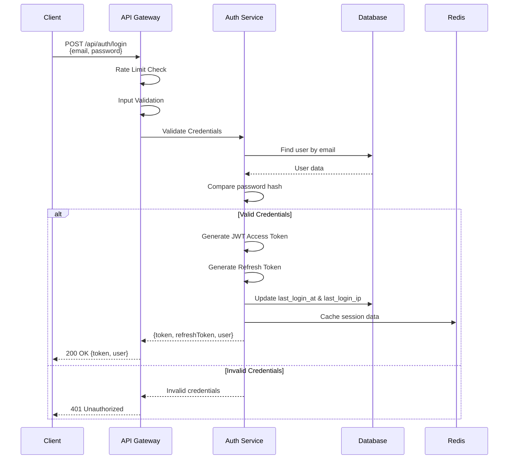
```mermaid
sequenceDiagram
    participant C as Client
    participant API as API Gateway
    participant A as Auth Service
    participant DB as Database
    participant R as Redis

    C->>API: POST /api/auth/login<br/>{email, password}
    API->>API: Rate Limit Check
    API->>API: Input Validation
    API->>A: Validate Credentials
    A->>DB: Find user by email
    DB-->>A: User data
    A->>A: Compare password hash
    alt Valid Credentials
        A->>A: Generate JWT Access Token
        A->>A: Generate Refresh Token
        A->>DB: Update last_login_at & last_login_ip
        A->>R: Cache session data
        A-->>API: {token, refreshToken, user}
        API-->>C: 200 OK {token, user}
    else Invalid Credentials
        A-->>API: Invalid credentials
        API-->>C: 401 Unauthorized
    end
```

---

## 2. Borrowing Process Flow

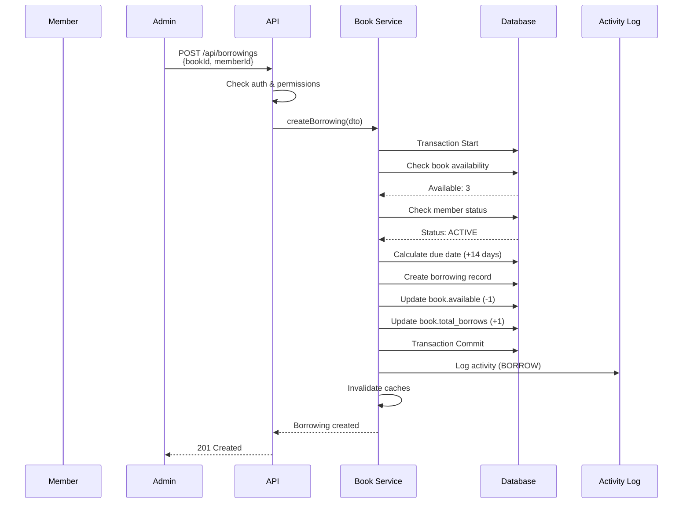
```mermaid
sequenceDiagram
    participant M as Member
    participant A as Admin
    participant API as API
    participant S as Book Service
    participant DB as Database
    participant L as Activity Log

    A->>API: POST /api/borrowings<br/>{bookId, memberId}
    API->>API: Check auth & permissions
    API->>S: createBorrowing(dto)
    S->>DB: Transaction Start
    S->>DB: Check book availability
    DB-->>S: Available: 3
    S->>DB: Check member status
    DB-->>S: Status: ACTIVE
    S->>DB: Calculate due date (+14 days)
    S->>DB: Create borrowing record
    S->>DB: Update book.available (-1)
    S->>DB: Update book.total_borrows (+1)
    S->>DB: Transaction Commit
    S->>L: Log activity (BORROW)
    S->>S: Invalidate caches
    S-->>API: Borrowing created
    API-->>A: 201 Created
```

---

## 3. Return Book Process Flow

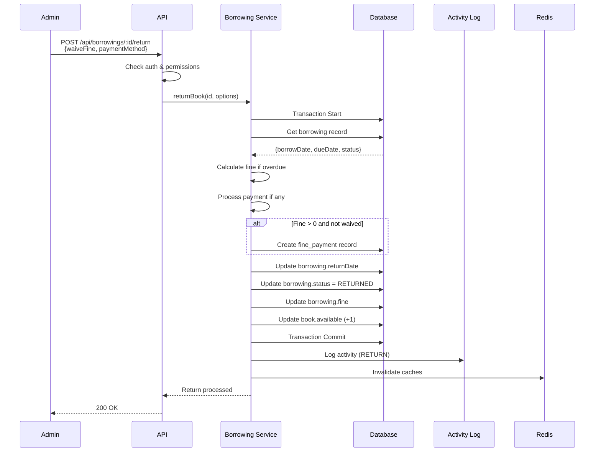
```mermaid
sequenceDiagram
    participant A as Admin
    participant API as API
    participant S as Borrowing Service
    participant DB as Database
    participant L as Activity Log
    participant R as Redis

    A->>API: POST /api/borrowings/:id/return<br/>{waiveFine, paymentMethod}
    API->>API: Check auth & permissions
    API->>S: returnBook(id, options)
    S->>DB: Transaction Start
    S->>DB: Get borrowing record
    DB-->>S: {borrowDate, dueDate, status}
    S->>S: Calculate fine if overdue
    S->>S: Process payment if any
    alt Fine > 0 and not waived
        S->>DB: Create fine_payment record
    end
    S->>DB: Update borrowing.returnDate
    S->>DB: Update borrowing.status = RETURNED
    S->>DB: Update borrowing.fine
    S->>DB: Update book.available (+1)
    S->>DB: Transaction Commit
    S->>L: Log activity (RETURN)
    S->>R: Invalidate caches
    S-->>API: Return processed
    API-->>A: 200 OK
```

---

## 4. Fine Calculation Logic

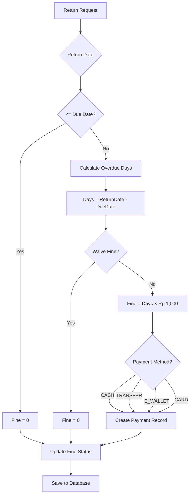
```mermaid
flowchart TD
    A[Return Request] --> B{Return Date}
    B --> C{<= Due Date?}
    C -->|Yes| D[Fine = 0]
    C -->|No| E[Calculate Overdue Days]
    E --> F[Days = ReturnDate - DueDate]
    F --> G{Waive Fine?}
    G -->|Yes| H[Fine = 0]
    G -->|No| I[Fine = Days × Rp 1,000]
    I --> J{Payment Method?}
    J -->|CASH| K[Create Payment Record]
    J -->|TRANSFER| K
    J -->|E_WALLET| K
    J -->|CARD| K
    K --> L[Update Fine Status]
    D --> L
    H --> L
    L --> M[Save to Database]
```

---

## 5. E-Book Upload Flow

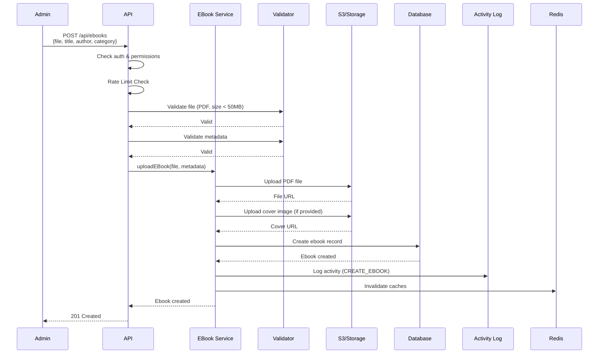
```mermaid
sequenceDiagram
    participant A as Admin
    participant API as API
    participant S as EBook Service
    participant V as Validator
    participant S3 as S3/Storage
    participant DB as Database
    participant L as Activity Log
    participant R as Redis

    A->>API: POST /api/ebooks<br/>{file, title, author, category}
    API->>API: Check auth & permissions
    API->>API: Rate Limit Check
    API->>V: Validate file (PDF, size < 50MB)
    V-->>API: Valid
    API->>V: Validate metadata
    V-->>API: Valid
    API->>S: uploadEBook(file, metadata)
    S->>S3: Upload PDF file
    S3-->>S: File URL
    S->>S3: Upload cover image (if provided)
    S3-->>S: Cover URL
    S->>DB: Create ebook record
    DB-->>S: Ebook created
    S->>L: Log activity (CREATE_EBOOK)
    S->>R: Invalidate caches
    S-->>API: Ebook created
    API-->>A: 201 Created
```

---

## 6. Search Flow with Caching

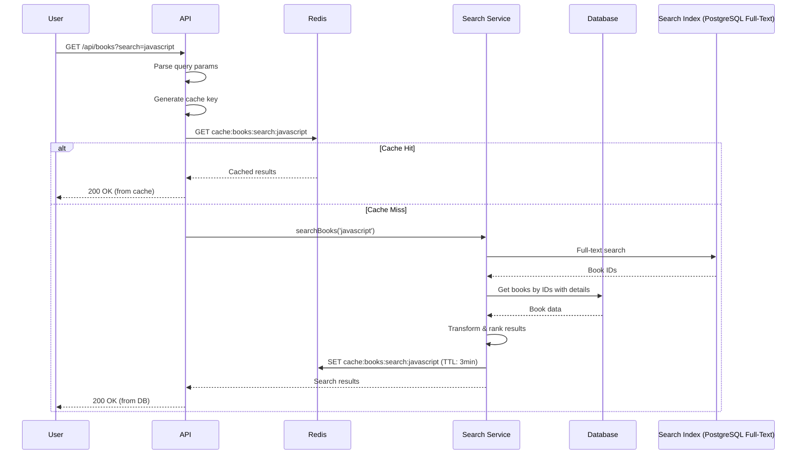
```mermaid
sequenceDiagram
    participant U as User
    participant API as API
    participant R as Redis
    participant S as Search Service
    participant DB as Database
    participant T as Search Index (PostgreSQL Full-Text)

    U->>API: GET /api/books?search=javascript
    API->>API: Parse query params
    API->>API: Generate cache key
    API->>R: GET cache:books:search:javascript
    alt Cache Hit
        R-->>API: Cached results
        API-->>U: 200 OK (from cache)
    else Cache Miss
        API->>S: searchBooks('javascript')
        S->>T: Full-text search
        T-->>S: Book IDs
        S->>DB: Get books by IDs with details
        DB-->>S: Book data
        S->>S: Transform & rank results
        S->>R: SET cache:books:search:javascript (TTL: 3min)
        S-->>API: Search results
        API-->>U: 200 OK (from DB)
    end
```

---

## 7. Report Generation Flow

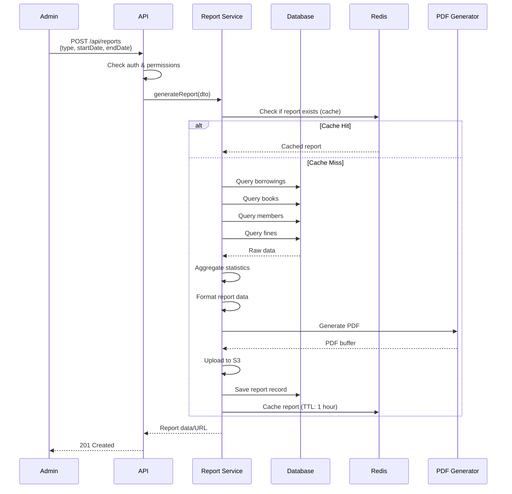
```mermaid
sequenceDiagram
    participant A as Admin
    participant API as API
    participant S as Report Service
    participant DB as Database
    participant R as Redis
    participant P as PDF Generator

    A->>API: POST /api/reports<br/>{type, startDate, endDate}
    API->>API: Check auth & permissions
    API->>S: generateReport(dto)
    S->>R: Check if report exists (cache)
    alt Cache Hit
        R-->>S: Cached report
    else Cache Miss
        S->>DB: Query borrowings
        S->>DB: Query books
        S->>DB: Query members
        S->>DB: Query fines
        DB-->>S: Raw data
        S->>S: Aggregate statistics
        S->>S: Format report data
        S->>P: Generate PDF
        P-->>S: PDF buffer
        S->>S: Upload to S3
        S->>DB: Save report record
        S->>R: Cache report (TTL: 1 hour)
    end
    S-->>API: Report data/URL
    API-->>A: 201 Created
```

---

## 8. Activity Logging Flow

```mermaid
sequenceDiagram
    participant U as User/Admin
    participant API as API
    participant S as Any Service
    participant L as Log Service
    participant DB as Database
    participant AM as Analytics

    U->>API: POST /api/books (create)
    API->>API: Check auth
    API->>S: Execute operation
    S->>DB: Create book record
    DB-->>S: Created
    S->>L: logActivity({
        action: CREATE,
        entity: BOOK,
        entityId: book.id,
        entityName: book.title,
        adminId: session.userId,
        adminName: session.user.name,
        ipAddress: request.ip,
        userAgent: request.headers['user-agent']
    })
    L->>DB: Create activity_log record
    L->>AM: Send to analytics (async)
    L->>AM: Increment counters
    S-->>API: Operation result
    API-->>U: Response
```

---

## 9. Member Suspension Flow

```mermaid
flowchart TD
    A[Suspend Member Request] --> B{Member Has Active Borrowings?}
    B -->|Yes| C[Cannot Suspend<br/>Return books first]
    B -->|No| D{Member Has Unpaid Fines?}
    D -->|Yes| E[Require Fine Payment<br/>or Waive Fine]
    D -->|No| F[Set suspension dates]
    F --> G[Update member.status = SUSPENDED]
    G --> H[Set suspension_start = NOW]
    H --> I[Set suspension_end = +X days]
    I --> J[Log Activity]
    J --> K[Invalidate Caches]
    K --> L[Notify Member (Email)]
    L --> M[Update Database]
    M --> N[Suspension Complete]
```

---

## 10. Book Status Lifecycle

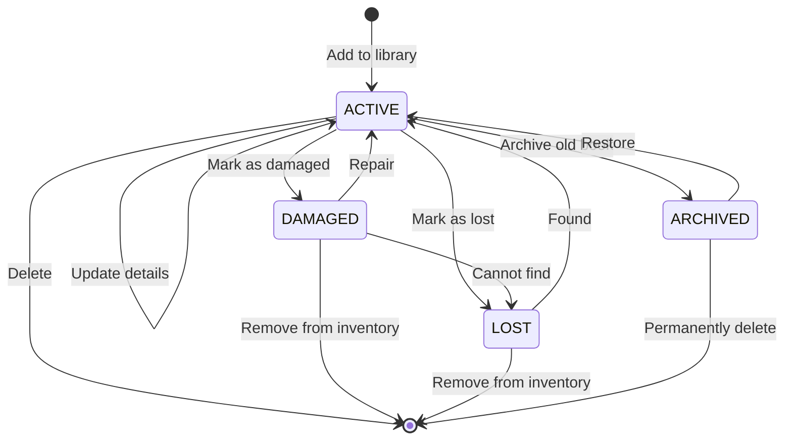
```mermaid
stateDiagram-v2
    [*] --> ACTIVE: Add to library
    ACTIVE --> ACTIVE: Update details
    ACTIVE --> DAMAGED: Mark as damaged
    ACTIVE --> LOST: Mark as lost
    ACTIVE --> ARCHIVED: Archive old book
    ACTIVE --> [*]: Delete

    DAMAGED --> ACTIVE: Repair
    DAMAGED --> LOST: Cannot find
    DAMAGED --> [*]: Remove from inventory

    LOST --> ACTIVE: Found
    LOST --> [*]: Remove from inventory

    ARCHIVED --> ACTIVE: Restore
    ARCHIVED --> [*]: Permanently delete
```

---

## 11. Admin Role Hierarchy & Permissions

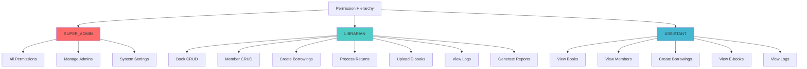
```mermaid
graph TD
    Root[Permission Hierarchy]

    Root --> SA[SUPER_ADMIN]
    Root --> LIB[LIBRARIAN]
    Root --> ASST[ASSISTANT]

    SA --> SA1[All Permissions]
    SA --> SA2[Manage Admins]
    SA --> SA3[System Settings]

    LIB --> L1[Book CRUD]
    LIB --> L2[Member CRUD]
    LIB --> L3[Create Borrowings]
    LIB --> L4[Process Returns]
    LIB --> L5[Upload E-books]
    LIB --> L6[View Logs]
    LIB --> L7[Generate Reports]

    ASST --> A1[View Books]
    ASST --> A2[View Members]
    ASST --> A3[Create Borrowings]
    ASST --> A4[View E-books]
    ASST --> A5[View Logs]

    style SA fill:#ff6b6b
    style LIB fill:#4ecdc4
    style ASST fill:#45b7d1
```

---

## 12. Cache Invalidation Strategy

```mermaid
flowchart TD
    A[Data Modification] --> B{Operation Type?}

    B -->|Create| C[Invalidate list caches<br/>Invalidate stats caches]
    B -->|Update| D[Invalidate entity cache<br/>Invalidate list caches<br/>Invalidate stats caches]
    B -->|Delete| E[Invalidate entity cache<br/>Invalidate list caches<br/>Invalidate stats caches<br/>Invalidate search caches]

    C --> F[Patterns to invalidate]
    D --> F
    E --> F

    F --> G[books:list:*]
    F --> H[members:list:*]
    F --> I[stats:*]
    F --> J[search:*]
    F --> K[book:{id}]
    F --> L[member:{id}]

    G --> M[Broadcast to Redis Pub/Sub]
    H --> M
    I --> M
    J --> M
    K --> M
    L --> M

    M --> N[All instances clear local cache]
```

---

## 13. Data Flow: Dashboard Statistics

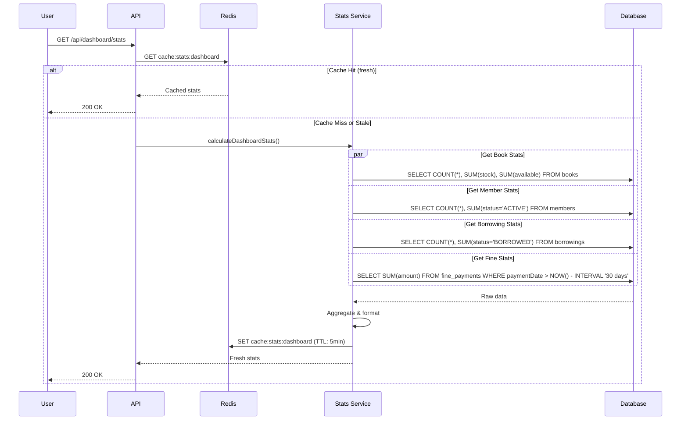
```mermaid
sequenceDiagram
    participant U as User
    participant API as API
    participant R as Redis
    participant S as Stats Service
    participant DB as Database

    U->>API: GET /api/dashboard/stats
    API->>R: GET cache:stats:dashboard
    alt Cache Hit (fresh)
        R-->>API: Cached stats
        API-->>U: 200 OK
    else Cache Miss or Stale
        API->>S: calculateDashboardStats()
        par Get Book Stats
            S->>DB: SELECT COUNT(*), SUM(stock), SUM(available) FROM books
        and Get Member Stats
            S->>DB: SELECT COUNT(*), SUM(status='ACTIVE') FROM members
        and Get Borrowing Stats
            S->>DB: SELECT COUNT(*), SUM(status='BORROWED') FROM borrowings
        and Get Fine Stats
            S->>DB: SELECT SUM(amount) FROM fine_payments WHERE paymentDate > NOW() - INTERVAL '30 days'
        end
        DB-->>S: Raw data
        S->>S: Aggregate & format
        S->>R: SET cache:stats:dashboard (TTL: 5min)
        S-->>API: Fresh stats
        API-->>U: 200 OK
    end
```

---

## 14. Error Handling Flow

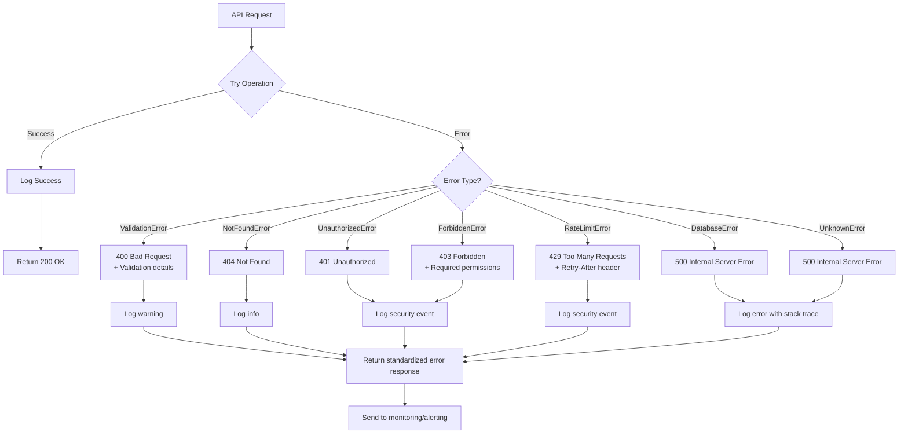
```mermaid
flowchart TD
    A[API Request] --> B{Try Operation}
    B -->|Success| C[Log Success]
    C --> D[Return 200 OK]
    B -->|Error| E{Error Type?}

    E -->|ValidationError| F[400 Bad Request<br/>+ Validation details]
    E -->|NotFoundError| G[404 Not Found]
    E -->|UnauthorizedError| H[401 Unauthorized]
    E -->|ForbiddenError| I[403 Forbidden<br/>+ Required permissions]
    E -->|RateLimitError| J[429 Too Many Requests<br/>+ Retry-After header]
    E -->|DatabaseError| K[500 Internal Server Error]
    E -->|UnknownError| L[500 Internal Server Error]

    F --> M[Log warning]
    G --> N[Log info]
    H --> O[Log security event]
    I --> O
    J --> P[Log security event]
    K --> Q[Log error with stack trace]
    L --> Q

    M --> R[Return standardized error response]
    N --> R
    O --> R
    P --> R
    Q --> R

    R --> S[Send to monitoring/alerting]
```

---

## 15. Book Borrowing Rules Engine

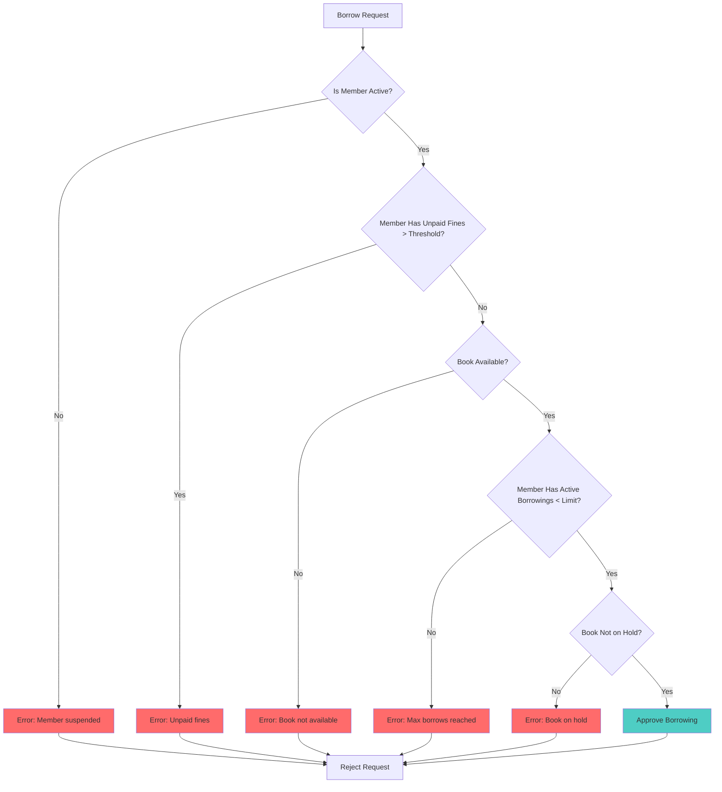
```mermaid
flowchart TD
    Start[Borrow Request] --> Rule1{Is Member Active?}
    Rule1 -->|No| Error1[Error: Member suspended]
    Rule1 -->|Yes| Rule2{Member Has Unpaid Fines > Threshold?}
    Rule2 -->|Yes| Error2[Error: Unpaid fines]
    Rule2 -->|No| Rule3{Book Available?}
    Rule3 -->|No| Error3[Error: Book not available]
    Rule3 -->|Yes| Rule4{Member Has Active Borrowings < Limit?}
    Rule4 -->|No| Error4[Error: Max borrows reached]
    Rule4 -->|Yes| Rule5{Book Not on Hold?}
    Rule5 -->|No| Error5[Error: Book on hold]
    Rule5 -->|Yes| Success[Approve Borrowing]

    Error1 --> End[Reject Request]
    Error2 --> End
    Error3 --> End
    Error4 --> End
    Error5 --> End
    Success --> End

    style Error1 fill:#ff6b6b
    style Error2 fill:#ff6b6b
    style Error3 fill:#ff6b6b
    style Error4 fill:#ff6b6b
    style Error5 fill:#ff6b6b
    style Success fill:#4ecdc4
```

---

## 16. E-book Viewing Flow

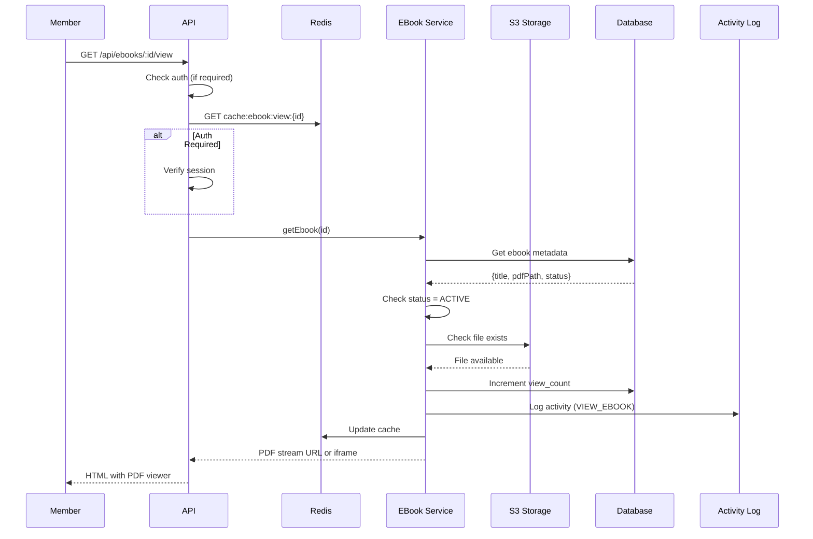
```mermaid
sequenceDiagram
    participant M as Member
    participant A as API
    participant R as Redis
    participant S as EBook Service
    participant S3 as S3 Storage
    participant DB as Database
    participant L as Activity Log

    M->>A: GET /api/ebooks/:id/view
    A->>A: Check auth (if required)
    A->>R: GET cache:ebook:view:{id}
    alt Auth Required
        A->>A: Verify session
    end
    A->>S: getEbook(id)
    S->>DB: Get ebook metadata
    DB-->>S: {title, pdfPath, status}
    S->>S: Check status = ACTIVE
    S->>S3: Check file exists
    S3-->>S: File available
    S->>DB: Increment view_count
    S->>L: Log activity (VIEW_EBOOK)
    S->>R: Update cache
    S-->>A: PDF stream URL or iframe
    A-->>M: HTML with PDF viewer
```

---

## 17. Database Backup & Recovery Flow

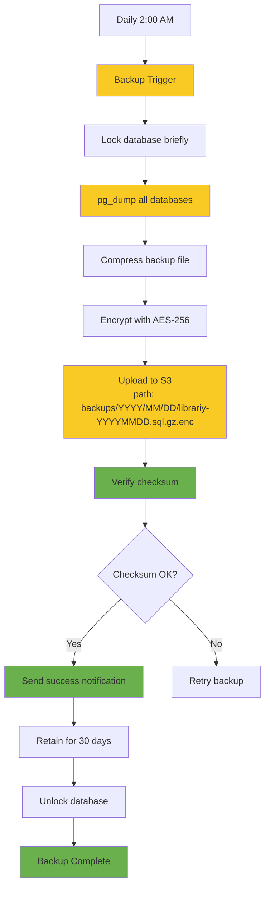
```mermaid
flowchart TD
    Start[Daily 2:00 AM] --> Trigger[Backup Trigger]
    Trigger --> Lock[Lock database briefly]
    Lock --> Dump[pg_dump all databases]
    Dump --> Compress[Compress backup file]
    Compress --> Encrypt[Encrypt with AES-256]
    Encrypt --> S3[Upload to S3<br/>path: backups/YYYY/MM/DD/librariy-YYYYMMDD.sql.gz.enc]
    S3 --> Verify[Verify checksum]
    Verify --> Success{Checksum OK?}
    Success -->|Yes| Notify[Send success notification]
    Success -->|No| Retry[Retry backup]
    Notify --> Retain[Retain for 30 days]
    Retain --> Unlock[Unlock database]
    Unlock --> Complete[Backup Complete]

    style Trigger fill:#f9ca24
    style Dump fill:#f9ca24
    style S3 fill:#f9ca24
    style Verify fill:#6ab04c
    style Notify fill:#6ab04c
    style Complete fill:#6ab04c
```

---

## 18. System Startup Sequence

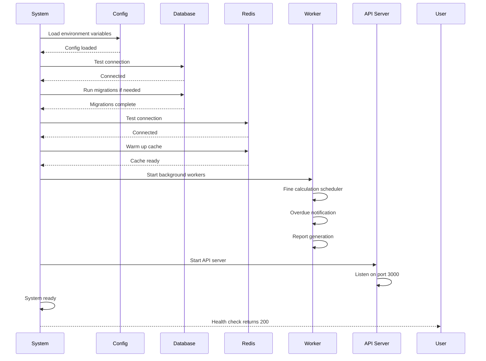
```mermaid
sequenceDiagram
    participant S as System
    participant C as Config
    participant DB as Database
    participant R as Redis
    participant W as Worker
    participant A as API Server

    S->>C: Load environment variables
    C-->>S: Config loaded

    S->>DB: Test connection
    DB-->>S: Connected

    S->>DB: Run migrations if needed
    DB-->>S: Migrations complete

    S->>R: Test connection
    R-->>S: Connected

    S->>R: Warm up cache
    R-->>S: Cache ready

    S->>W: Start background workers
    W->>W: Fine calculation scheduler
    W->>W: Overdue notification
    W->>W: Report generation

    S->>A: Start API server
    A->>A: Listen on port 3000

    S->>S: System ready
    S-->>User: Health check returns 200
```

---

## 19. Fine Notification System

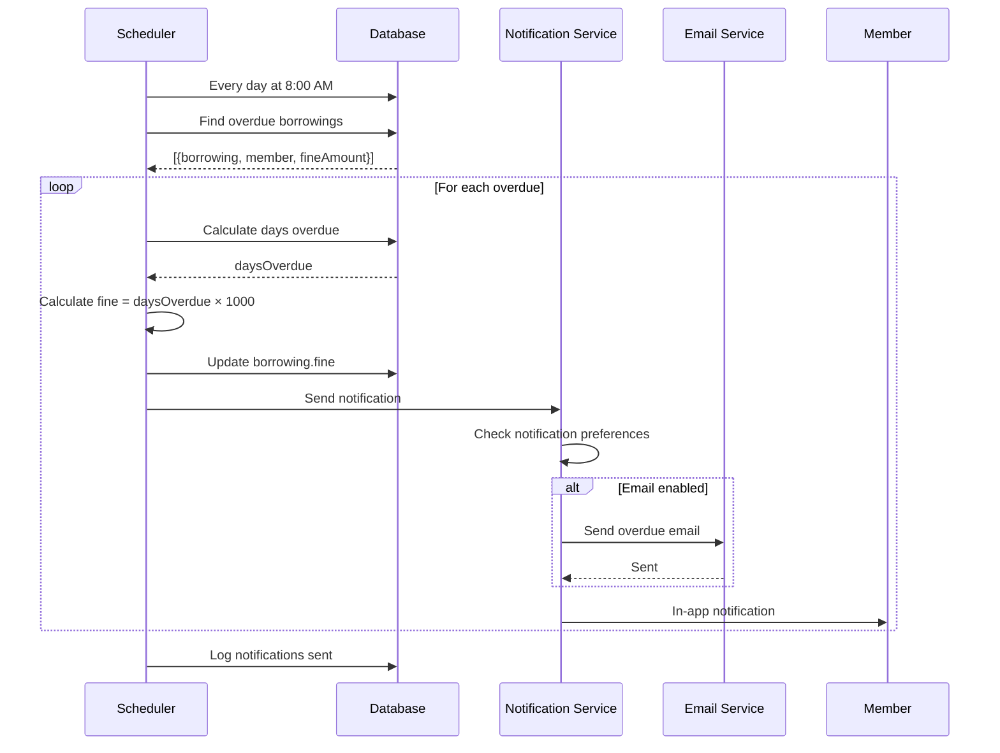
```mermaid
sequenceDiagram
    participant S as Scheduler
    participant DB as Database
    participant N as Notification Service
    participant E as Email Service
    participant M as Member

    S->>DB: Every day at 8:00 AM
    S->>DB: Find overdue borrowings
    DB-->>S: [{borrowing, member, fineAmount}]

    loop For each overdue
        S->>DB: Calculate days overdue
        DB-->>S: daysOverdue
        S->>S: Calculate fine = daysOverdue × 1000
        S->>DB: Update borrowing.fine

        S->>N: Send notification
        N->>N: Check notification preferences
        alt Email enabled
            N->>E: Send overdue email
            E-->>N: Sent
        end
        N->>M: In-app notification
    end

    S->>DB: Log notifications sent
```

---

## 20. API Request Processing Pipeline

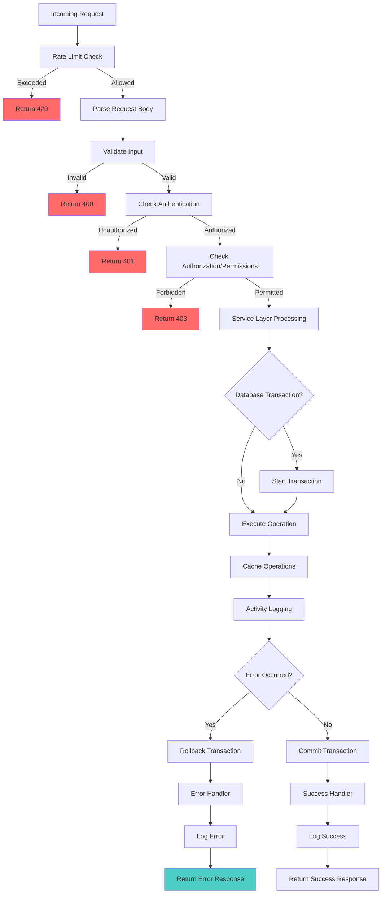
```mermaid
flowchart TD
    A[Incoming Request] --> B[Rate Limit Check]
    B -->|Exceeded| Limit[Return 429]
    B -->|Allowed| C[Parse Request Body]
    C --> D[Validate Input]
    D -->|Invalid| Validation[Return 400]
    D -->|Valid| E[Check Authentication]
    E -->|Unauthorized| Auth[Return 401]
    E -->|Authorized| F[Check Authorization/Permissions]
    F -->|Forbidden| Perm[Return 403]
    F -->|Permitted| G[Service Layer Processing]
    G --> H{Database Transaction?}
    H -->|Yes| I[Start Transaction]
    H -->|No| K[Execute Operation]
    I --> K
    K --> L[Cache Operations]
    L --> M[Activity Logging]
    M --> N{Error Occurred?}
    N -->|Yes| O[Rollback Transaction]
    O --> P[Error Handler]
    P --> Q[Log Error]
    Q --> R[Return Error Response]
    N -->|No| S[Commit Transaction]
    S --> T[Success Handler]
    T --> U[Log Success]
    U --> V[Return Success Response]

    style Limit fill:#ff6b6b
    style Validation fill:#ff6b6b
    style Auth fill:#ff6b6b
    style Perm fill:#ff6b6b
    style R fill:#4ecdc4
```

---

## Summary of Key Flows

1. **Authentication**: JWT-based with refresh token mechanism
2. **Authorization**: RBAC with permission-based access control
3. **Caching**: Multi-layer caching (Redis, CDN, Browser)
4. **Database**: Primary-replica replication for scalability
5. **Monitoring**: Structured logging with request tracing
6. **Error Handling**: Standardized error responses across all endpoints
7. **Security**: Rate limiting, input validation, encryption
8. **Performance**: Connection pooling, query optimization, indexing

All flows follow consistent patterns:
- Input validation before processing
- Authentication & authorization checks
- Transaction-based database operations
- Cache invalidation on mutations
- Activity logging for audit trails
- Comprehensive error handling
